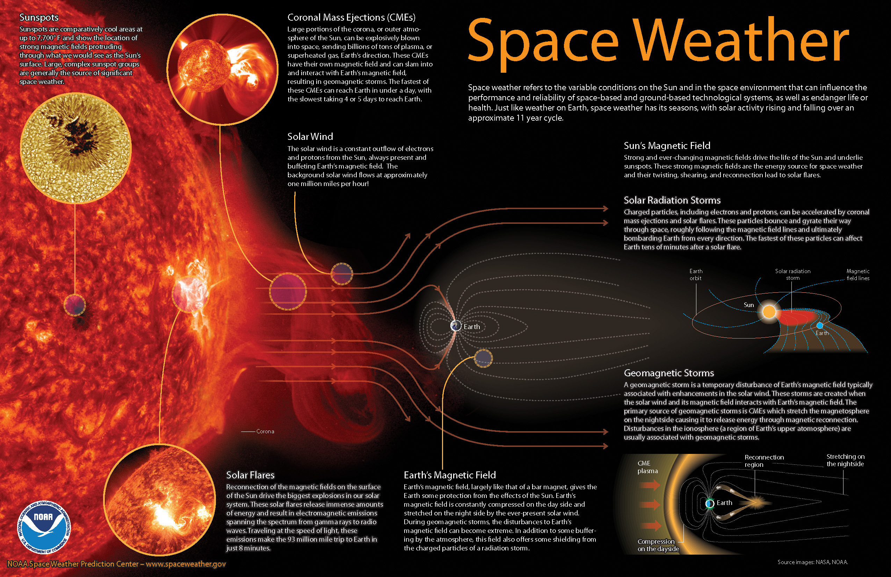
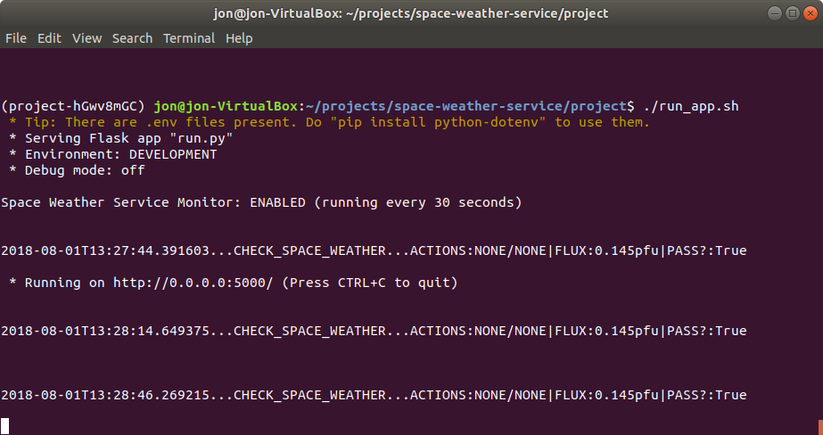
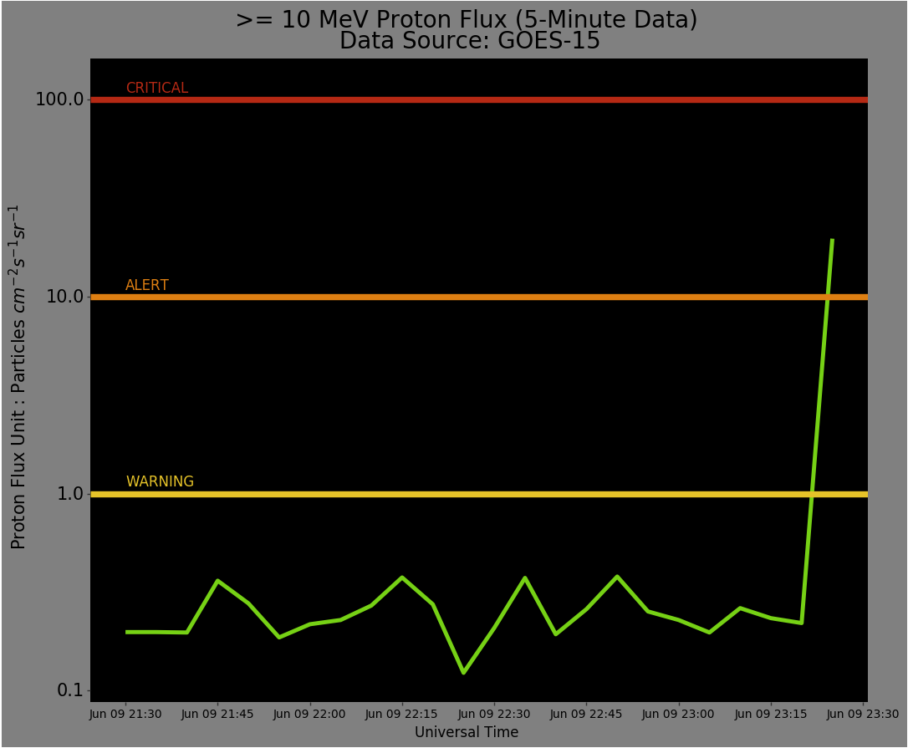
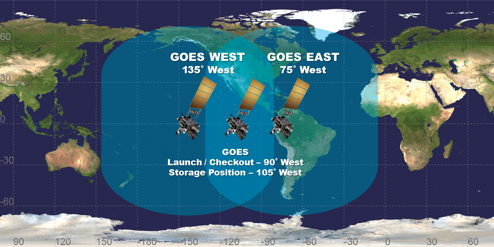
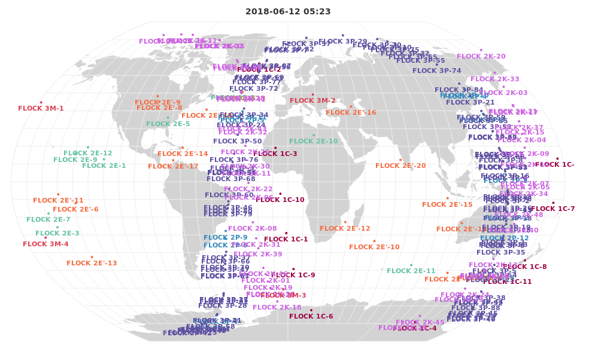

# Introduction
					
The <strong>Space Weather Service</strong> is a lightweight, deployable service for alerting satellite operators to the potential hazards of high-energy particles in the ionosphere.

The Space Weather Service consists of two parts: 

* An <strong>Open API</strong> that consists of a set of URL endpoints and provides users with real-time space weather data.
* And a <strong>Persistent Monitor</strong> that issues real-time notifications (Alerts, Warnings, Critical and Info) of current space weather events in the form of emails (w/ plots) and an HTTP POST message alert.
					
This documentation page covers the fundamentals of space weather as well as instructions on setting up this service, how it works and some ideas for future improvements.

# What Is Space Weather?
					
<a href="https://www.swpc.noaa.gov/about-space-weather">Space weather</a> is a generic term for the various physics phenomena that occur throughout the solar system, particularly effects driven by the Sun which primarily affect the Earth. These phenonema include solar winds, geomagnetic storms, aurora, solar flares and many more. Of particular importance to satellite operators are those phenomena that occur in Earth's ionosphere and have the potential to impact satellite operations, including <a href="https://www.swpc.noaa.gov/impacts/satellite-communications">communications</a> and <a href="https://www.swpc.noaa.gov/impacts/satellite-drag">orbital decay</a>.
					
 
<a href="http://www.noaa.gov/explainers/space-weather-storms-from-sun">Source</a>

NOAA's <a href="https://www.swpc.noaa.gov/homepage">Space Weather Prediction Center (SWPC)</a> provides space weather measurements and forecasts based on data collected by a variety of satellites, incuding the fleet of Geostationary Operational Environmental Satellites (GOES).

The Space Weather Service developed here utilizes the <a href="https://www.swpc.noaa.gov/products/goes-proton-flux">GOES Proton Flux</a> product provided by the SWPC, a measurement of high-energy protons in the ionosphere that can disrupt satellite communications. This Space Weather Service is intended to monitor proton flux levels and issue internal notifications to satellite operators depending on the severity of events.

# How To Run This Service
					
The Space Weather Service is built in Python as a Flask application, developed in a VM running Ubuntu. It was built as a prototype service which can be run locally, or eventually deployed in a production environment.
					
This service was built using the following versions of these development tools:
* VM: VirtualBox 5.2.10
* OS: Ubuntu 18.04 LTS
* Language: Python 3.6.5
* Framework: Flask 1.0.2

# Installation
					
To run the service locally on a machine (or VM) running <a href="http://releases.ubuntu.com/18.04/">Ubuntu 18.04</a>, first make sure you have Python 3.6.5 available.
					
In a Terminal, run the following:

<pre><code>
  python3 -V
</code></pre>

Then, install the package manager/virtual environment tool <a href="">pipenv</a>:

<pre><code>
  sudo apt update 
  sudo apt install python3-pip 
  sudo -H pip3 install -U pipenv
  sudo apt-get install python3-tk
</code></pre>

Next, navigate to the <code>space-weather-service/project</code> directory.

And last, install all Python library requirements from Pipefile:

<pre><code>
  pipenv install
</code></pre>

NOTE: There's also a <code>install_and_run.sh</code> script that compiles all of these commands and runs them in sequence, ending on starting up the Flask application server! This is a one-stop-shop script that should speed up the process. It also relies on a <code>.env</code> file that includes some FLASK_ environment variables that are described more below.

To run this installer:

<pre><code>
  ./install_and_run.sh
</code></pre>

# Edit Configuration

In order to customize the functionality of the Space Weather Service, you'll need to edit the <code>config.json</code> file before starting up the app server.

Note that the configuration settings are stored in a <code>.json</code> file, intended for portability and accessibility!

The set of available configuration parameters are shown below, which must be defined for each intended environment (e.g. DEFAULT, DEVELOPMENT, PRODUCTION, etc).

<pre><code>
  "*{ENVIRONMENT}*": {
    "DATA_PRIMARY_URL": "http://services.swpc.noaa.gov/text/goes-particle-flux-primary.txt",
    "DATA_SECONDARY_URL": "http://services.swpc.noaa.gov/text/goes-particle-flux-secondary.txt",
    "DATA_LINK": "https://www.swpc.noaa.gov/products/goes-proton-flux",
    "MESSAGE_URL": "https://httpbin.org/post",
    "MESSAGE_RECIPIENTS": [*{RECIPIENT_EMAIL(S)}*],
     "MESSAGE_SENDER": *{SENDER_EMAIL}*,
    "SMTP_HOST": *{SMTP_HOST}*,
    "SMTP_PORT": *{SMTP_PORT}*,
    "SMTP_USERNAME": *{SMTP_USERNAME}*,
    "SMTP_PASSWORD": *{SMTP_PASSWORD}*,
    "MONITOR_ENABLED": "1",
    "MONITOR_TRIGGER_INTERVAL_S": "30"
  }
</code></pre>

* DATA_ refers to the source of space weather data, and can either be URL's to NOAA's dynamic, real-time .txt files OR a localhost URL pointing to some sample data .txt files served locally by a simple HTTP server.
* MESSAGE_ refers to both the URL that the monitoring HTTP POST requests will be sent AND the recipient(s)/sender for the notification emails.
* SMTP_ refers to the email server details needed to programmatically send emails.
* MONITOR_ENABLED refers to the whether the background monitoring service is enabled (1) or disabled (0).
* MONITOR_TRIGGER_INTERVAL_S is the number of seconds between each monitoring  triggers (i.e. each time the service checks the space weather data).

The environment is defined in the shell script <code>run_app.sh</code> that starts the app server, as defined by the line <code>export FLASK_ENV=*{ENVIRONMENT}*</code>. The <code>FLASK_ENV</code> parameter must match one of environment keys in the <code>config.json</code> file! Currently, configuration settings for only two environments are specified: DEFAULT and DEVELOPMENT.

# Starting The Service

With the project and its requirements installed, and with the <code>config.json</code> properly edited, it's time to start the Space Weather Service!

First, activate the pipenv shell from the project directory:

<pre><code>
  pipenv shell
</code></pre> 

Then, make sure the <code>run_app.sh</code> shell script is properly set up. It should look something like this:

<pre><code>
  #!/bin/sh

  export FLASK_APP=run.py
  export FLASK_DEBUG=0
  export FLASK_ENV=DEVELOPMENT

  flask run -h 0.0.0.0
</code></pre>

The FLASK_DEBUG option can be turned on/off, the environment variable can be edited as needed and the localhost IP address where the app server will run can be changed as needed.

While in the pipenv shell, run the <code>run_app.sh</code> shell script to start the Flask app:

<pre><code>./run_app.sh</code></pre> 

In the Terminal, you should see the app server start up! If the Persistent Monitor is enabled, there should also be messages each time the Space Weather Service monitor triggers.

Also, the Open API portion of the Space Weather Service includes four API end-points that can be directly accessed using curl, an API tool like Insomnia, etc. By default, the app server URL should be 0.0.0.0:5000.
 

# How It Works

The Space Weather Service is built on the Python/Flask microframework and utilizes a number of custom modules to build up functionality for the Open API and Persistent Monitor services.

The primary focus of the Space Weather Service is providing the Persistent Monitor for ongoing monitoring and notifications of space weather events, specifically proton flux levels. By default, the Persistent Monitor runs every 30 seconds to check the NOAA space weather data and issues proton flux level alerts as needed (via emails and HTTP POST messages).

As an additional feature, some of the functions that make up the Persistent Monitor are used to provide raw data via various URL endpoints of the Open API.

The logic for the monitoring / notification service of the Persistent Monitor (as defined in the project specifications) is shown below:

<pre><code>
  Space Weather Service
  Monitoring/Notification Logic 

  For Proton Flux @ &gt;=10 MeV Level:

  Proton Flux &gt; 1 pfu.....WARNING....EMAIL 
  Proton Flux &gt; 10 pfu....ALERT......EMAIL + HTTP POST
  Proton Flux &gt; 100 pfu...CRITICAL...EMAIL + HTTP POST
  Proton Flux &lt; 1 pfu  
  For At Least 90 min.....INFO.......EMAIL + HTTP POST
</code></pre>

The email notification includes summary information about the event and provides a plot (example show below) of the available proton flux data, roughly the previous 2 hours of 5-min proton flux data provided by NOAA's SWPC.

Along with an email, an HTTP POST message (in JSON) is sent to a user-configurable URL in the following format:

<pre><code>
  {
    "alert_text": "Space weather 10: &gt;=10 MeV proton flux currently at 19.7 pfu!",
    "level": 10,
    "link": "https://www.swpc.noaa.gov/products/goes-proton-flux",
    "value": 19.7
  }
</code></pre>

And finally, the Open API portion of the service provides a set of URL end-points that can (i) run the space weather monitoring check, (ii) get all space weather data available and (iii) get specific space weather data by a given signal (e.g. P1, P5, P10, P50, P100 where P# is the &gt;= # MeV proton flux level). Once the app server is up and running, the API end-points can be found at the URL's below (where the localhost IP/Port address is specified in <code>run_app.sh</code>). By default, the app server (and therefore Open API) will be at the local address 0.0.0.0:5000.

The following are currently available Open API endpoints:

* 0.0.0.0:5000/get-data
* 0.0.0.0:5000/get-data-by-signal/{SIGNAL} (where {SIGNAL} = 'P10' for example)
* 0.0.0.0:5000/check-space-weather

# Code Structure

The Space Weather Service uses a fairly simple Flask application code structure. At the moment, the Persistent Monitor and Open API services have been bundled into a single application, where The modules that make up the application have been built in such a way to allow for the coexistence of these two services. Additionally, the majority of the modules simply define object-oriented classes to improve readibility, structure and scalability of the application.

The Persistent Monitor and Open API services are fundamentally based on the <code>processes.py</code> module, which uses other specific modules to create separate processes with various functionality. The <code>views.py</code> module uses different processes to expose various end-points for the Open API; and similarly the <code>monitors.py</code> module combines processes to build up the Persistent Monitor.

The Space Weather Service also uses local storage for dynamically created files, including <code>plot.png</code> (for email graphics) and <code>state.json</code> to handle state tracking for the Persistent Monitor. A local state file is used to manage the state transitions of the notification actions (i.e. WARNING, ALERT, CRITICAL and INFO). This state tracking could also be managed using a small database, which would likely be the preferred method in a production application.

Finally, the project structure for the Space Weather Service is shown below:

<pre><code>
     project
     |
     |-- run_app.sh
     |-- config.json
     |-- run.py
     |--	app
     |	|-- __init__.py
     |	|-- actions.py
     |	|-- data.py
     |	|-- errors.py
     |	|-- filemanagers.py
     |	|-- message.py
     |	|-- monitors.py
     |	|-- plots.py
     |	|-- processes.py
     |	|-- views.py
     |	|-- plots
     |	|	 |-- plot.png
     |	|-- state
     |	|	 |-- state.json
     |-- data
     |-- tests
     |	|-- run_tests.sh
     |	|-- test_data.py
     |	|-- test_monitors.py
     |-- Pipefile
     |-- Pipfile.lock
     |-- README.txt
</code></pre>

# Testing

A suite of unit tests have been compiled for this project, specifically targeting the <code>data.py</code> and <code>monitors.py</code> modules. These two modules provide most of the data processing cababilities of the project, so unit tests were written to focus on the output of various module functions and check for proper data type handling.

The Python library <a href="https://docs.pytest.org/en/latest/">pytest</a> was used to handle unit testing. Two sets of testing scripts were compiled, <code>test/test_data.py</code> and <code>test/test_monitors.py</code>, totalling 12 different function tests.

The tests are performed by running the testing shell script from the Terminal:

<pre><code>test/run_tests.sh</code></pre>

Note that with <code>FLASK_ENV=DEFAULT</code> in the <code>run_test.sh</code> shell script, space weather data is loaded from static .txt data files located in the 'data' directory (as currently defined in <code>config.json</code>).These .txt data files can be edited as desired to test the functionality of the space weather monitoring service, specifically changing values in the 'P &gt;10' column in order to simulate different proton flux events. These can be edited to try and simulated WARNING, ALERT, CRITICAL and INFO actions.

To use these static data .txt files, you'll need to start up a separate HTTP server to make the data files available to the application. In another Terminal, navigate to the <code>project/data</code> directory. Then run the following line:

<pre><code>
  python3 -m http.server 5001
</code></pre>

Also, make sure the IP:PORT address of this data server matches up with the DATA_ URL's in the <code></code>config.json file! With this server up and running, the Space Weather Service should be to get the static .txt data files for testing.

# Future Projects

The required functionality for this Space Weather Service is to provide a notification and monitoring system for space weather (and specifically proton flux) events, a task that is currently provided by this project's Persistent Monitor service.

However in the course of developing this project, I thought of some additional features that could be added to potentially improve this Space Weather Service in support of satellite operations.

As examples, three additional features include:
* More API Endpoints
* Satellite Tracking
* Satellite Drag and Solar UV Flux

# More API Endpoints

The current number of API endpoints in this service is somewhat limited. Depending on the expected user base of this service (number of users, other services, rate of access, etc), additional endpoints could be added to improve data sharing across multiple teams or microservices.
					
As an example, additional space weather data types (either from NOAA SWPC or elsewhere) exposed via the Open API could be used by other microservices, where raw data and specific alerts from NOAA or other entities could be ingested and provided. Or more advanced calculations on the space weather data could be done in the service and provided as well.
					
Depending on the use case of other groups or services, an extended API endpoint offering could provide improved functionality for other services looking to leverage space weather data.

# Detailed Alerts with Satellite Tracking

The proton flux data used in this project is provided by NOAA's SWPC courtesy of scientific sensors onboard the GOES 14 and 15 satellites. The GOES series of satellites operate in fixed geostationary orbits (see below), and therefore have a fixed coverage of data from their scientific measurements.

 <a href="https://www.nasa.gov/feature/goddard/nasa-celebrates-contributions-to-40-years-of-noaa-goes-satellites">Source</a> 

However, low-Earth orbit satellites operate at much lower altitudes than the GOES spacecraft, down in polar Low Earth Orbits (LEO's), resulting in a criss-crossing in and out of the GOES measurement coverage areas.

 <a href="http://bl.ocks.org/syntagmatic/raw/6c149c08fc9cde682635/cubesat2.html">Source</a> 

This Space Weather Service only provides a notification and alerting system off of a point-source proton flux measurement from a single region of space where a GOES satellites is stationed. However, more detail about a given proton flux event could be gained by includinga secondary source of proton flux measurements (i.e. secondary data from another GOES satellite).
				
Additionally, the orbital positions of a satellite fleet could be used to narrow down expected proton flux impacts to specific satellites in the fleet. Alerts could be satellite-specific and driven by knowing when the satellite would be passing through the measurement coverage of the GOES satellites. Additionally, the relationship between the GOES measurements and wider-spread proton flux behavior in the ionosphere (and its impact to satellite operations) would need to be studied in more detail.
					
# Satellite Drag and Solar UV Flux

Some low-Earth orbit satellites are capable of limited orbital control using <a href="https://www.youtube.com/watch?v=nh0kJgHKeXo">differential-drag</a>. Differential-drag is a method of adjusting the orientation of a satellite's solar panels to utilitize the (minimal) atmospheric drag in Low Earth Orbit as a form of spacecraft control.
					
One challenge of this control task is the variability of the temperature and density of the atmosphere caused by solar weather effects, resulting in potentially variable <a href="https://www.swpc.noaa.gov/impacts/satellite-drag">satellite drag</a> characteristics during differential-drag operations. Additional space weather data (geomagnetic storm alerts, solar flux levels, etc) could be used to further improve satellite control and operations, either by feeding directly into calculations for differential-drag control or by providing alerts for satellite operators to know when to try and avoid differential-drag operations.
		
# Thanks!

Thanks for reading about the Space Weather Service! This project was built as part of an application process for a space systems engineering role at a satellite company. 

If you have any questions/comments/suggestions about this work, I'd love to hear them. You can find me and my contact info at <a href="https://engelsjk.com/about">engelsjk.com/about</a>.

